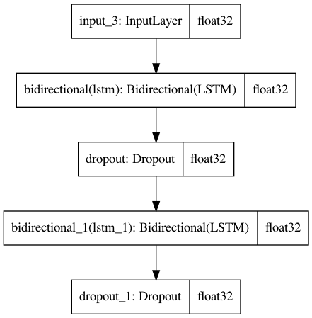

## 1 method one


Siamese Network 是一种神经网络的框架，而不是具体的某种网络，就像seq2seq一样，具体实现上可以使用RNN,CNN,也可以使用Transformer。

Siamese network就是“连体的神经网络”，神经网络的“连体”是通过共享权值来实现的。(共享权值即左右两个神经网络的权重一模一样)

siamese network的作用是衡量两个输入的相似程度。孪生神经网络有两个输入（Input1 and Input2）,将两个输入feed进入两个神经网络（Network1 and Network2），这两个神经网络分别将输入映射到新的空间，形成输入在新的空间中的表示。通过Loss的计算，评价两个输入的相似度。

```python
# from hydra.utils.gpu_usage import limit_gpu_memory
# limit_gpu_memory(int(2) * 1024, 1)
```

### 构建数据

```python
import pandas as pd
import numpy as np
import jieba
import gensim
from keras.preprocessing.text import Tokenizer, text_to_word_sequence
from keras.preprocessing.sequence import pad_sequences
import os
os.environ['TF_CPP_MIN_LOG_LEVEL'] = '2'
```

```python
df_train = pd.read_csv("./data/siamese/df_train.txt",sep="\\t", header=None,engine='python')
df_test = pd.read_csv("./data/siamese/df_test.txt",sep="\\t", header=None,engine='python')
```

```python
df =  df_train.append(df_test)
```

```python
sent1 = [ list(i) for i in df[0].tolist()]
sent2 = [ list(i) for i in df[1].tolist()]
```

```python
tokenizer = Tokenizer(num_words=None,lower=False, char_level=True, split="")
tokenizer.fit_on_texts(sent1+sent2)
```

```python
word_dict = tokenizer.word_index
word_num = len(word_dict)+1
max_length = max(len(i) for i in sent1+sent2)
```

```python
word_num, max_length
```

```python
x1 = tokenizer.texts_to_sequences(sent1)
x2 = tokenizer.texts_to_sequences(sent2)
```

```python
x1 = pad_sequences(x1, maxlen=max_length, value=0,truncating='post',padding='post')
x2 = pad_sequences(x2, maxlen=max_length, value=0,truncating='post',padding='post')
```

```python
y = df[[2]].to_numpy()
```

```python
train_x1 = x1[:len(df_train),:]
train_x2 = x2[:len(df_train),:]
train_y = y[:len(df_train),:]

test_x1 = x1[len(df_train):,:]
test_x2 = x2[len(df_train):,:]
test_y = y[len(df_train):,:]
```

```python
print(train_x1.shape, train_x2.shape, train_y.shape)
print(test_x1.shape, test_x2.shape, test_y.shape)
```

### 加载词向量

```python
emb_path = "./data/siamese/token_vec_300.bin"
word_dim = 300
embedding_dict = gensim.models.KeyedVectors.load_word2vec_format(emb_path, binary=False)

embedding_matrix = np.zeros((word_num, word_dim))
for word, i in word_dict.items():
    if word in embedding_dict.vocab:
        embedding_matrix[i] = embedding_dict[word]
```

### 构建模型

```python
from keras.utils import plot_model
from keras import backend as K
from keras.preprocessing.sequence import pad_sequences
from keras.models import Model, load_model
from keras.layers import Input, Embedding, LSTM, Dropout, Lambda, Bidirectional

'''基于曼哈顿空间距离计算两个字符串语义空间表示相似度计算'''
def exponent_neg_manhattan_distance(inputX):
    (sent_left, sent_right) = inputX
    return K.exp(-K.sum(K.abs(sent_left - sent_right), axis=1, keepdims=True))

'''基于欧式距离的字符串相似度计算'''
def euclidean_distance(inputX):
    (sent_left, sent_right) = inputX
    sum_square = K.sum(K.square(sent_left - sent_right), axis=1, keepdims=True)
    return K.sqrt(K.maximum(sum_square, K.epsilon()))

'''共享权重的share model'''
def create_base_network(input_shape):
    inputs = Input(shape=input_shape)
    lstm1 = Bidirectional(LSTM(128, return_sequences=True))(inputs)
    lstm1 = Dropout(0.5)(lstm1)
    lstm2 = Bidirectional(LSTM(32))(lstm1)
    lstm2 = Dropout(0.5)(lstm2)
    mode = Model(inputs=inputs, outputs=lstm2)
    return mode

embedding_layer = Embedding(input_dim = word_num,
                            output_dim = word_dim,
                            weights=[embedding_matrix],
                            input_length=max_length,
                            trainable= False,
                            mask_zero=True)

left_input = Input(shape=(max_length,))
right_input = Input(shape=(max_length,))

encoded_left = embedding_layer(left_input)
encoded_right = embedding_layer(right_input)

shared_lstm = create_base_network(input_shape=(max_length,word_dim)) # 最后真正使用的编码模型
left_output = shared_lstm(encoded_left)
right_output = shared_lstm(encoded_right)
distance = Lambda(exponent_neg_manhattan_distance)([left_output, right_output])
model = Model(inputs = [left_input, right_input], outputs = distance) # 训练时使用的模型
model.compile(loss='binary_crossentropy', optimizer='nadam', metrics=['accuracy'])
model.summary()
```

```python
# plot_model(model,to_file='model.png',show_shapes=True,show_dtype=True)
```


```python
# plot_model(shared_lstm,to_file='shared_lstm.png',show_shapes=True,show_dtype=True)
```



```python
model.fit(x=[train_x1, train_x2],y=train_y,epochs=20,batch_size=512,validation_data=([test_x1, test_x2],test_y))
```

Train on 80000 samples, validate on 20000 samples

Epoch 1/20
80000/80000 [==============================] - 93s 1ms/step - loss: 0.9593 - accuracy: 0.5796 - val_loss: 0.7200 - val_accuracy: 0.5636

Epoch 2/20
80000/80000 [==============================] - 90s 1ms/step - loss: 0.6209 - accuracy: 0.6570 - val_loss: 0.6127 - val_accuracy: 0.6524

Epoch 3/20
80000/80000 [==============================] - 90s 1ms/step - loss: 0.5816 - accuracy: 0.6923 - val_loss: 0.6153 - val_accuracy: 0.6568

Epoch 4/20
80000/80000 [==============================] - 91s 1ms/step - loss: 0.5519 - accuracy: 0.7189 - val_loss: 0.6632 - val_accuracy: 0.6291

Epoch 5/20
80000/80000 [==============================] - 91s 1ms/step - loss: 0.5218 - accuracy: 0.7410 - val_loss: 0.5540 - val_accuracy: 0.7023

Epoch 6/20
80000/80000 [==============================] - 90s 1ms/step - loss: 0.4969 - accuracy: 0.7596 - val_loss: 0.5079 - val_accuracy: 0.7439

Epoch 7/20
80000/80000 [==============================] - 91s 1ms/step - loss: 0.4738 - accuracy: 0.7752 - val_loss: 0.5471 - val_accuracy: 0.7117

Epoch 8/20
80000/80000 [==============================] - 91s 1ms/step - loss: 0.4562 - accuracy: 0.7852 - val_loss: 0.4987 - val_accuracy: 0.7452

Epoch 9/20
80000/80000 [==============================] - 90s 1ms/step - loss: 0.4425 - accuracy: 0.7918 - val_loss: 0.4707 - val_accuracy: 0.7652

Epoch 10/20
80000/80000 [==============================] - 91s 1ms/step - loss: 0.4284 - accuracy: 0.8003 - val_loss: 0.4761 - val_accuracy: 0.7612

Epoch 11/20
80000/80000 [==============================] - 91s 1ms/step - loss: 0.4161 - accuracy: 0.8065 - val_loss: 0.5010 - val_accuracy: 0.7473

Epoch 12/20
80000/80000 [==============================] - 91s 1ms/step - loss: 0.4066 - accuracy: 0.8134 - val_loss: 0.4525 - val_accuracy: 0.7781

Epoch 13/20
80000/80000 [==============================] - 91s 1ms/step - loss: 0.3978 - accuracy: 0.8178 - val_loss: 0.4766 - val_accuracy: 0.7632

Epoch 14/20
80000/80000 [==============================] - 91s 1ms/step - loss: 0.3906 - accuracy: 0.8215 - val_loss: 0.4565 - val_accuracy: 0.7769

Epoch 15/20
80000/80000 [==============================] - 90s 1ms/step - loss: 0.3854 - accuracy: 0.8234 - val_loss: 0.4668 - val_accuracy: 0.7731

Epoch 16/20
80000/80000 [==============================] - 90s 1ms/step - loss: 0.3792 - accuracy: 0.8274 - val_loss: 0.4383 - val_accuracy: 0.7902

Epoch 17/20
80000/80000 [==============================] - 90s 1ms/step - loss: 0.3741 - accuracy: 0.8308 - val_loss: 0.4404 - val_accuracy: 0.7860

Epoch 18/20
80000/80000 [==============================] - 91s 1ms/step - loss: 0.3690 - accuracy: 0.8315 - val_loss: 0.4370 - val_accuracy: 0.7921

Epoch 19/20
80000/80000 [==============================] - 90s 1ms/step - loss: 0.3621 - accuracy: 0.8352 - val_loss: 0.4485 - val_accuracy: 0.7865

Epoch 20/20
80000/80000 [==============================] - 91s 1ms/step - loss: 0.3593 - accuracy: 0.8374 - val_loss: 0.4450 - val_accuracy: 0.7903
