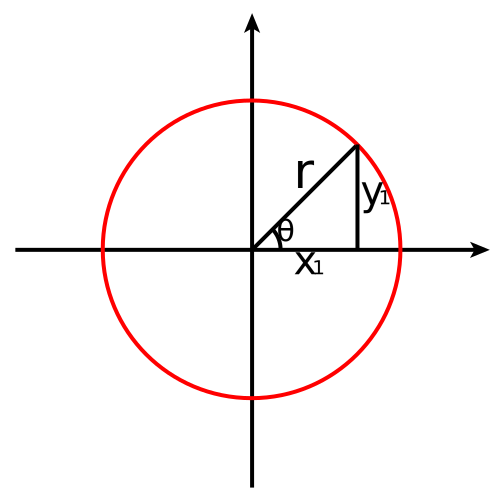

# 3-1,低阶API示范


下面的范例使用TensorFlow的低阶API实现线性回归模型和DNN二分类模型。

低阶API主要包括张量操作，计算图和自动微分。

```python
import tensorflow as tf
from datetime import datetime

#打印时间分割线
@tf.function
def printbar():
    time = datetime.now().strftime("%Y-%m-%d %H:%M:%S")
    tf.print("=========="*4+time)
printbar()
```

### 一，线性回归模型


**1，准备数据**

```python
import numpy as np
import pandas as pd
from matplotlib import pyplot as plt
import tensorflow as tf

#样本数量
n=400

#生成测试用数据
X= tf.random.uniform([n,2],minval=-10,maxval=10)
w0=tf.constant([[2.0],[-3.0]])
b0 =tf.constant([[3.0]])
Y = X@w0+b0+tf.random.normal([n,1],mean=0.0,stddev =2.0)
```

```python
#数据可视化
%matplotlib inline
%config InlineBackend.figure_format='svg'
ax = plt.subplot(111,projection='3d')
ax.scatter(X[:,0],X[:,1],Y[:,0],c='r')
ax.set_zlabel('Z')  # 坐标轴
ax.set_ylabel('Y')
ax.set_xlabel('X')
plt.show()
```

```python
# 构建数据管道迭代器
def data_iter(features,labels,batch_size=8):
    num_examples = len(features)
    indices = list(range(num_examples))
    np.random.shuffle(indices)
    for i in range(0,num_examples,batch_size):
        indexs= indices[i:min(i+batch_size,num_examples)]
        yield tf.gather(X,indexs),tf.gather(Y,indexs)

# 测试数据管道效果   
batch_size = 8
(features,labels) = next(data_iter(X,Y,batch_size))
print(features)
print(labels)
```

**2，定义模型**

```python
w = tf.Variable(tf.random.normal(w0.shape))
b = tf.Variable(tf.zeros_like(b0,dtype = tf.float32))

# 定义模型
class LinearRegression:
    # 正向传播
    def __call__(self,x):
        return x@w+b
    # 损失函数
    def loss_func(self,y_true,y_pred):
        return tf.reduce_mean((y_true-y_pred)**2/2)
model = LinearRegression()
```

**3，训练模型**

```python
#使用动态调试
def trian_step(model,features,labels):
    with tf.GradientTape() as tape:
        predictions = model(features)
        loss = model.loss_func(labels,predictions)
    
    # 反向传播求梯度
    dloss_dw,dloss_db = tape.gradient(loss,[w,b])
    # 梯度下降法更新参数
    w.assign(w-0.001*dloss_dw)
    b.assign(b-0.001*dloss_db)
    return loss
```

```python
# 测试train_step效果
batch_size =10
(features,labels) = next(data_iter(X,Y,batch_size))
trian_step(model,features,labels)
```

```python
def train_model(model,epochs):
    for epoch in tf.range(1,epochs+1):
        for features,labels in data_iter(X,Y,10):
            loss = trian_step(model,features,labels)
        if epoch%20==0:
            printbar()
            tf.print("epoch=",epoch,"loss=",loss)
            tf.print("w=",w)
            tf.print("b=",b)
train_model(model,epochs = 100)
```

```python
##使用autograph机制转换成静态图加速

@tf.function
def train_step(model, features, labels):
    with tf.GradientTape() as tape:
        predictions = model(features)
        loss = model.loss_func(labels, predictions)
    # 反向传播求梯度
    dloss_dw,dloss_db = tape.gradient(loss,[w,b])
    # 梯度下降法更新参数
    w.assign(w - 0.001*dloss_dw)
    b.assign(b - 0.001*dloss_db)
    
    return loss

def train_model(model,epochs):
    for epoch in tf.range(1,epochs+1):
        for features, labels in data_iter(X,Y,10):
            loss = train_step(model,features,labels)
        if epoch%20==0:
            printbar()
            tf.print("epoch =",epoch,"loss = ",loss)
            tf.print("w =",w)
            tf.print("b =",b)

train_model(model,epochs = 100)
```

```python
# 结果可视化
%matplotlib inline
%config InlineBackend.figure_format="svg"

plt.figure(figsize=(12,5))
ax = plt.subplot(111)
ax = plt.subplot(111,projection='3d')
h1 = ax.scatter(X[:,0],X[:,1],Y[:,0],c='b',marker="*")
h2 = ax.scatter(X[:,0],X@w0+b0,c="g",marker="o")
h3 = ax.scatter(X[:,0],X@w+b,c="r",marker=".")
ax.set_zlabel('Z')  # 坐标轴
ax.set_ylabel('Y')
ax.set_xlabel('X')
plt.legend([h1,h2,h3],["true","random_true","predict"])
plt.show()

```

### 二，DNN二分类模型


**1，准备数据**

```python
import numpy as np 
import pandas as pd 
from matplotlib import pyplot as plt
import tensorflow as tf
%matplotlib inline
%config InlineBackend.figure_format = 'svg'
```

```python
#正负样本数量
n_positive,n_negative = 2000,2000

#生成正样本, 小圆环分布
r_p = 5.0 + tf.random.truncated_normal([n_positive,1],0.0,1.0)
theta_p = tf.random.uniform([n_positive,1],0.0,2*np.pi) 
theta_p
```



```python
#生成正样本, 小圆环分布
r_p = 5.0 + tf.random.truncated_normal([n_positive,1],0.0,1.0)
theta_p = tf.random.uniform([n_positive,1],0.0,2*np.pi) 
Xp = tf.concat([r_p*tf.cos(theta_p),r_p*tf.sin(theta_p)],axis = 1)
Yp = tf.ones_like(r_p)

#生成负样本, 大圆环分布
r_n = 8.0 + tf.random.truncated_normal([n_negative,1],0.0,1.0)
theta_n = tf.random.uniform([n_negative,1],0.0,2*np.pi) 
Xn = tf.concat([r_n*tf.cos(theta_n),r_n*tf.sin(theta_n)],axis = 1)
Yn = tf.zeros_like(r_n)

# 汇总样本
X = tf.concat([Xp,Xn],axis=0)
Y = tf.concat([Yp,Yn],axis=0)

#可视乎
plt.figure(figsize=(6,6))
plt.scatter(Xp[:,0],Xp[:,1],c="r")
plt.scatter(Xn[:,0],Xn[:,1],c="g")
```

```python
# 构建数据管道迭代器
def data_iter(features, labels, batch_size=8):
    num_examples = len(features)
    indices = list(range(num_examples))
    np.random.shuffle(indices)  #样本的读取顺序是随机的
    for i in range(0, num_examples, batch_size):
        indexs = indices[i: min(i + batch_size, num_examples)]
        yield tf.gather(X,indexs), tf.gather(Y,indexs)
        
# 测试数据管道效果   
batch_size = 10
(features,labels) = next(data_iter(X,Y,batch_size))
print(features)
print(labels)
```

**2，定义模型**

```python
class DNNModel(tf.Module):
    def __init__(self,name=None):
        super(DNNModel,self).__init__(name=name)
        self.w1 = tf.Variable(tf.random.truncated_normal([2,4]),dtype = tf.float32)
        self.b1 = tf.Variable(tf.zeros([1,4]),dtype = tf.float32)
        self.w2 = tf.Variable(tf.random.truncated_normal([4,8]),dtype = tf.float32)
        self.b2 = tf.Variable(tf.zeros([1,8]),dtype = tf.float32)
        self.w3 = tf.Variable(tf.random.truncated_normal([8,1]),dtype = tf.float32)
        self.b3 = tf.Variable(tf.zeros([1,1]),dtype = tf.float32)
    # 正向传播
    @tf.function(input_signature=[tf.TensorSpec(shape = [None,2], dtype = tf.float32)])  
    def __call__(self,x):
        x = tf.nn.relu(x@self.w1 + self.b1)
        x = tf.nn.relu(x@self.w2 + self.b2)
        y = tf.nn.sigmoid(x@self.w3 + self.b3)
        return y
    @tf.function(input_signature=[tf.TensorSpec(shape = [None,1], dtype = tf.float32),
                              tf.TensorSpec(shape = [None,1], dtype = tf.float32)])  
    
    # 损失函数(二元交叉熵)
    def loss_func(self,y_true,y_pred):  
        #将预测值限制在1e-7以上, 1-e-7以下，避免log(0)错误
        eps = 1e-7
        y_pred = tf.clip_by_value(y_pred,eps,1.0-eps)
        bce = - y_true*tf.math.log(y_pred) - (1-y_true)*tf.math.log(1-y_pred)
        return  tf.reduce_mean(bce)
    
    # 评估指标(准确率)
    @tf.function(input_signature=[tf.TensorSpec(shape = [None,1], dtype = tf.float32),
                              tf.TensorSpec(shape = [None,1], dtype = tf.float32)]) 
    def metric_func(self,y_true,y_pred):
        y_pred = tf.where(y_pred>0.5,tf.ones_like(y_pred,dtype = tf.float32),
                          tf.zeros_like(y_pred,dtype = tf.float32))
        acc = tf.reduce_mean(1-tf.abs(y_true-y_pred))
        return acc
model = DNNModel()
```

```python
# 测试模型结构
batch_size =10
(features,labels)=next(data_iter(X,Y,batch_size))

predictions = model(features)
loss = model.loss_func(labels,predictions)
metric = model.metric_func(labels,predictions)
tf.print("init loss:",loss)
tf.print("init metric",metric)
```

```python
print(len(model.trainable_variables)) #可变的变量，并不是可变的参数
```

```python
##使用autograph机制转换成静态图加速

@tf.function
def train_step(model, features, labels):
    
    # 正向传播求损失
    with tf.GradientTape() as tape:
        predictions = model(features)
        loss = model.loss_func(labels, predictions) 
        
    # 反向传播求梯度
    grads = tape.gradient(loss, model.trainable_variables)
    
    # 执行梯度下降
    for p, dloss_dp in zip(model.trainable_variables,grads):
        p.assign(p - 0.001*dloss_dp)
        
    # 计算评估指标
    metric = model.metric_func(labels,predictions)
    
    return loss, metric


def train_model(model,epochs):
    for epoch in tf.range(1,epochs+1):
        for features, labels in data_iter(X,Y,100):
            loss,metric = train_step(model,features,labels)
        if epoch%100==0:
            printbar()
            tf.print("epoch =",epoch,"loss = ",loss, "accuracy = ", metric)
        

train_model(model,epochs = 600)
```

```python

```
